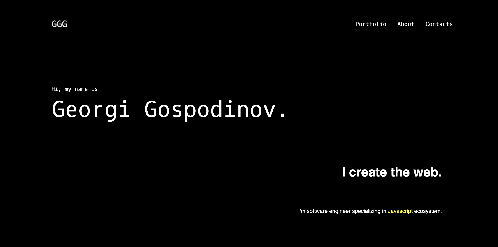

# ShowMyWork App
> Live demo [_here_](http://3gbg.s3-website.eu-west-2.amazonaws.com/#intro). <!-- If you have the project hosted somewhere, include the link here. -->

## Table of Contents
* [General Info](#general-information)
* [Technologies Used](#technologies-used)
* [Features](#features)
* [Screenshots](#screenshots)
* [Project Status](#project-status)
* [Contact](#contact)
<!-- * [License](#license) -->

## General Information
- ShowMyWork is personal Portfolio website.

## Technologies Used
- HTML
- CSS
- Visual Studio Code - v1.71.2
- macOS - v12.6

## Features
- List Projects 

## Screenshots

## Project Status
Project is: _in progress_ 

## Contact
Created by [@GGG](http://3gbg.s3-website.eu-west-2.amazonaws.com/#intro) - feel free to contact me!
